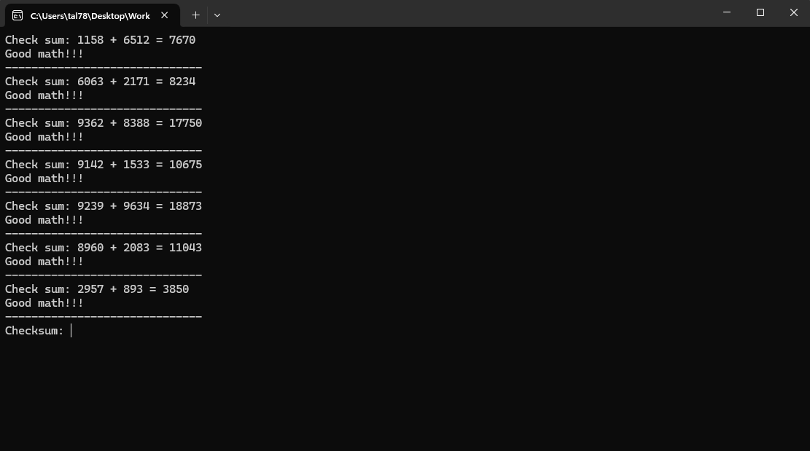
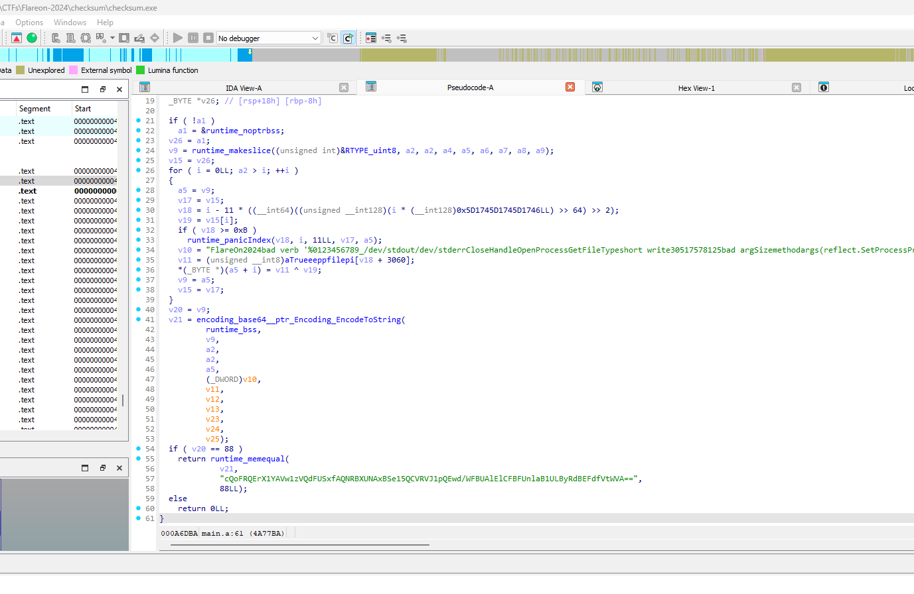
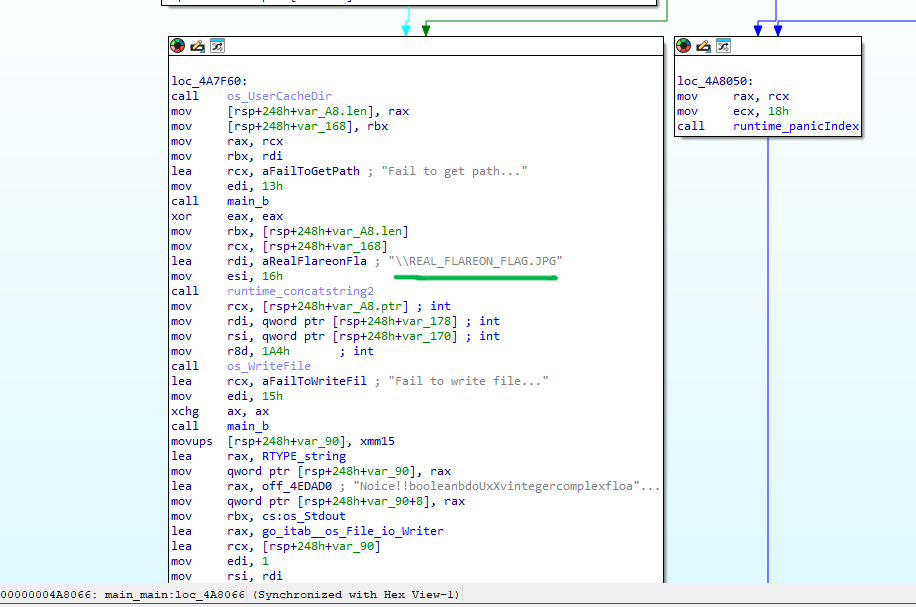

# Challenge 2 - checksum

> We recently came across a silly executable that appears benign. It just asks us to do some math… From the strings found in the sample, we suspect there are more to the sample than what we are seeing. Please investigate and let us know what you find!

## Overview
We are given an executable written in Go, which includes many library functions because it is statically linked.  
As the challenge's name suggests, we need to provide the correct checksum.
	
  

## Solution
If we take a look at `main_a` function, it returns `true` if we provided the correct checksum and `false` otherwise.  

  

As we can see, in line 36 there is an XOR operation, and before that in line 32, there is a check if `v18 >= 0xB` which is then used as an offset in the string `v11`. This corresponds exactly to the length of the string **`FlareOn2024`** in line 34 (0xB or 11 characters).  
Because Golang doesn't terminate strings with a null terminator like C but instead stores strings as an object with their length, IDA decompiles it incorrectly.  
However, it's still clear that some string is being encrypted here using the **XOR key - `FlareOn2024`**.  

After that, the result is encoded in base64 and compared with the following long base64 string: **`cQoFRQErX1YAVw1zVQdFUSxfAQNRBXUNAxBSe15QCVRVJ1pQEwd/WFBUAlElCFBFUnlaB1ULByRdBEFdfVtWVA==`**.  
I decoded this base64 string and decrypted it using the XOR key we found (see [decrypt_checksum.py](decrypt_checksum.py)), which gives us the correct checksum: **`7fd7dd1d0e959f74c133c13abb740b9faa61ab06bd0ecd177645e93b1e3825dd`**

Finally, if we look at the end of the `main()` function, we find a directory where a file gets generated:  

The generated image is:  

**Flag: Th3_M4tH_Do_b3_mAth1ng@flare-on.com**
