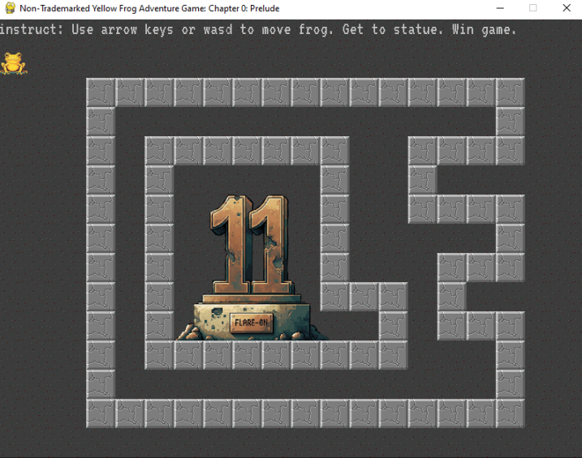

# Challenge 1 - frog

> Welcome to Flare-On 11! Download this 7zip package, unzip it with the password ‘flare’, and read the README.txt file for launching instructions. It is written in PyGame so it may be runnable under many architectures, but also includes a pyinstaller created EXE file for easy execution on Windows.
Your mission is get the frog to the “11” statue, and the game will display the flag. Enter the flag on this page to advance to the next stage. All flags in this event are formatted as email addresses ending with the @flare-on.com domain.

## Introduction
We are given an Exe (a game) and it's python source code. We need to play the game to get the flag, but I chose a different approach.



## Solution
Open `frog.py`, locate the `GenerateFlagText(x, y)` function, and check where it’s called.  
There’s only one call to it on `line 134` — `GenerateFlagText(player.x, player.y)`. The parameters passed are `player.x` and `player.y`, which are equal to `victory_tile.x` and `victory_tile.y`, respectively. If you scroll up, you’ll see that `victory_tile` is a vector defined in pygame:  
`victory_tile = pygame.Vector2(10, 10)`.  

From here, we can call the `GenerateFlagText` function with `x` and `y` set to `10`:  

```py
def GenerateFlagText(x, y):
    key = x + y * 20
    encoded = "\xa5\xb7\xbe\xb1\xbd\xbf\xb7\x8d\xa6\xbd\x8d\xe3\xe3\x92\xb4\xbe\xb3\xa0\xb7\xff\xbd\xbc\xfc\xb1\xbd\xbf"
    return ''.join([chr(ord(c) ^ key) for c in encoded])

print(GenerateFlagText(10, 10))
```

**Flag: welcome_to_11@flare-on.com**