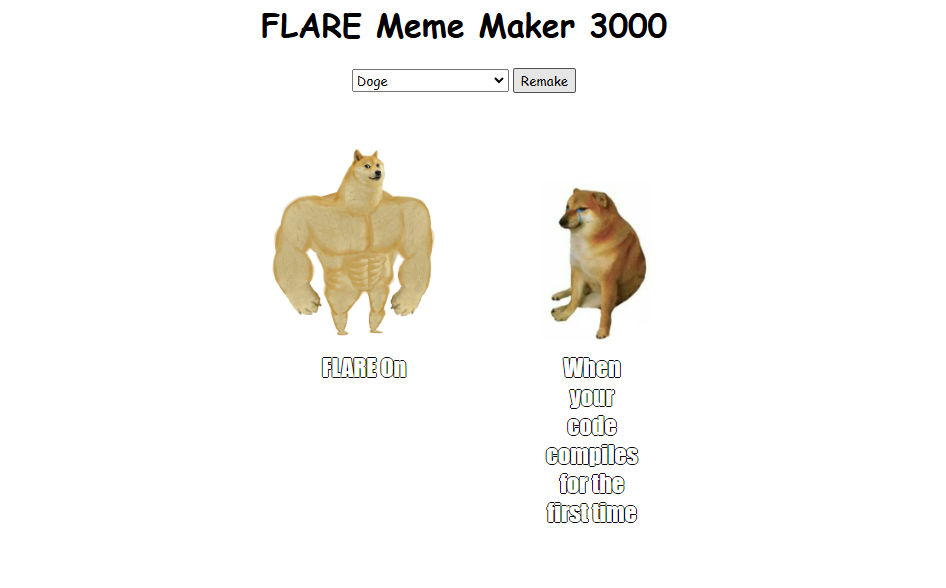
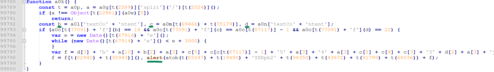
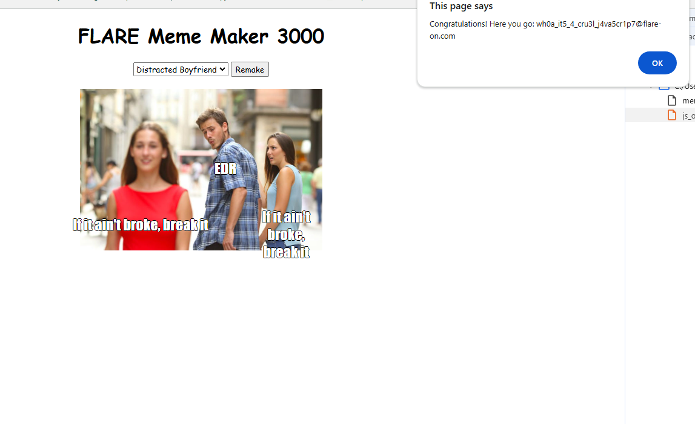

# Challenge 4 - Meme Maker 3000

> You’ve made it very far, I’m proud of you even if noone else is. You’ve earned yourself a break with some nice HTML and JavaScript before we get into challenges that may require you to be very good at computers.

# Overview
We are given an html file that represents a website called "Meme Maker 3000", which contains some obfuscated javascript.  

# Solution
The function `a0k()` prints the flag.  
You can see it does something odd with `Date()` and `alert()`, so we investigate it.

It checks if the current photo is the "Distracted Boyfriend", and also if three specific texts are chosen: `'FLARE On'`, `'Security Expert'`, and `'Malware'`.  
If these conditions are true, the function passes the checks and generates a string (the flag) by combining characters from specific indexes in those text variables (`b`, `c`, and `d` in the function) along with some hardcoded characters, as seen below:  
  

Finally, it converts the crafted flag (in variable `f`) to lowercase and shows it with `alert()`.  

**Flag: wh0a_it5_4_cru3l_j4va5cr1p7@flare-on.com**
